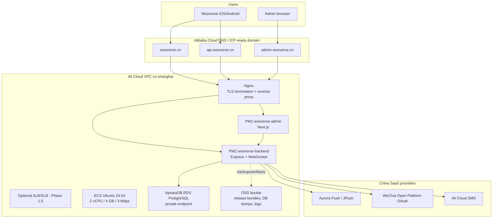

# Phase 1 Ali Cloud Replatform Plan

Source baseline: `main` at `4f0ab66`.
Target timeline: 2-3 engineering days after Ali Cloud account, domain, WeChat, JPush, and SMS credentials are ready.

## Goals

- Move the production runtime to Ali Cloud native infrastructure in `cn-shanghai`.
- Keep the current Express/PostgreSQL/Expo React Native architecture intact for Phase 1.
- Replace Expo Push delivery with Aurora Push/JPush for China network reachability.
- Add WeChat OAuth and Ali Cloud SMS login while preserving legacy `device_id` JWT auth.
- Put `wooverse.cn` behind HTTPS and deploy from GitHub Actions to ECS.

## Infrastructure Diagram



Phase 1 can run without ALB/SLB because the requested ECS is single-node and bandwidth-limited. Keep the diagram's ALB/SLB as a Phase 1.5 upgrade path if TLS rotation, WAF, or multi-ECS HA becomes necessary.

## DNS And Routing Plan

| Host | Route | Target |
| --- | --- | --- |
| `wooverse.cn` | `https://wooverse.cn/` | Nginx -> admin app on `127.0.0.1:8101` |
| `admin.wooverse.cn` | `https://admin.wooverse.cn/` | Nginx -> admin app on `127.0.0.1:8101` |
| `api.wooverse.cn` | `https://api.wooverse.cn/api/*` | Nginx -> backend on `127.0.0.1:8102` |
| `api.wooverse.cn/ws` | WebSocket upgrade | Nginx -> backend `/ws` on `127.0.0.1:8102` |
| `api.wooverse.cn/health` | health probe | Nginx -> backend `/health` |

Nginx should force HTTP to HTTPS once the domain resolves and certificate issuance succeeds. Before DNS cutover, keep the existing public IP health check available only for deployment validation, then restrict direct IP usage through Nginx server_name rules and security group policy.

TLS options:

- Preferred: Ali Cloud Certificate Management Service certificate for `wooverse.cn`, `admin.wooverse.cn`, and `api.wooverse.cn`.
- Acceptable for Phase 1: Let's Encrypt via `certbot` on ECS if ICP/domain DNS state allows issuance.

Security group:

- Inbound: `80/tcp`, `443/tcp`, and temporary SSH from Peter/CI source IPs only.
- Internal only: backend/admin PM2 ports, PostgreSQL RDS private endpoint.
- Outbound: JPush API, WeChat OAuth API, Ali Cloud SMS API, GitHub release download if deploy pulls from GitHub.

## Database Migration Approach

Current state:

- PostgreSQL schema is SQL migration based.
- Core tables: `users`, `groups`, `group_members`, `locations`, `sos_events`, `push_tokens`, and run/stat tables.
- Current auth supports email/password, Apple, and legacy `device_id`.
- Current push table stores one Expo push token per user.

Target:

- ApsaraDB RDS PostgreSQL in `cn-shanghai`, private VPC access from ECS.
- Same database name (`wooverse`) and app-level auth model.
- No PostgreSQL RLS; preserve current Express JWT middleware decision.

Migration sequence:

1. Provision RDS PostgreSQL with private endpoint, automated backups, and a least-privilege application user.
2. Freeze writes during cutover or run a short maintenance window; Phase 1 does not need logical replication.
3. Dump current production database:

   ```bash
   pg_dump --format=custom --no-owner --no-acl --dbname="$SOURCE_DATABASE_URL" --file=wooverse-prod.dump
   ```

4. Upload the dump to the ECS deploy directory or OSS private bucket.
5. Restore into ApsaraDB:

   ```bash
   pg_restore --clean --if-exists --no-owner --no-acl --dbname="$TARGET_DATABASE_URL" wooverse-prod.dump
   ```

6. Run schema validation:

   ```sql
   SELECT table_name FROM information_schema.tables WHERE table_schema = 'public' ORDER BY table_name;
   SELECT count(*) FROM users;
   SELECT count(*) FROM groups;
   SELECT count(*) FROM push_tokens;
   ```

7. Point backend env vars at RDS private host: `DB_HOST`, `DB_PORT`, `DB_NAME`, `DB_USER`, `DB_PASS`.
8. Smoke test `/health`, login/register, group join/create, location update, WebSocket connect, SOS trigger, and admin pages before DNS cutover.

Phase 1 schema migrations:

- Add auth columns or identity table for China login:
  - Conservative option: add nullable `wechat_openid`, `wechat_unionid`, `phone_e164`, `phone_verified_at`.
  - Better long-term option: add `auth_identities(user_id, provider, subject, metadata, created_at, last_login_at)` and keep `users` stable.
- Add SMS verification table with TTL semantics:
  - `sms_login_codes(phone_e164, code_hash, expires_at, consumed_at, attempts, created_at)`.
- Update `push_tokens` for provider-aware tokens:
  - Keep `token` column for compatibility, store JPush `registration_id` in `token`.
  - Add `provider TEXT NOT NULL DEFAULT 'expo'`, `app_key TEXT`, `last_seen_at TIMESTAMPTZ`, `disabled_at TIMESTAMPTZ`.
  - Keep one active token per user for Phase 1; revisit multi-device after WeChat/SMS account linking is stable.

Do not edit existing migrations. Add the next numbered migration and make it idempotent with `IF NOT EXISTS`.

## Auth Flow Design

### Compatibility Model

All auth methods issue the same JWT shape consumed by `requireAuth`:

```json
{
  "userId": "uuid",
  "deviceId": "legacy-device-id-or-null",
  "wechatOpenId": "openid-or-null",
  "phone": "+86...",
  "email": "email-or-null"
}
```

Legacy clients keep using:

- `POST /api/auth/register` with `device_id` and `name`.
- Existing `Authorization: Bearer <token>` header.

New clients can use WeChat or SMS. Backend should link identities to an existing user when a valid JWT is already present, and create or find a user when no JWT is present.

### WeChat OAuth

Mobile app:

1. User taps WeChat login.
2. App invokes native WeChat SDK and receives an OAuth `code`.
3. App sends `POST /api/auth/wechat` with `{ code, device_id?, name? }`.

Backend:

1. Validate request body.
2. Exchange `code` with WeChat Open Platform using server-side `WECHAT_APP_ID` and `WECHAT_APP_SECRET`.
3. Receive `openid`, optional `unionid`, and profile fields allowed by scope.
4. If caller already has a valid JWT, attach WeChat identity to that user unless it is already linked elsewhere.
5. If no JWT, find user by `unionid` first, then `openid`; otherwise create a user.
6. Reject banned users.
7. Update `last_login_at` and return `{ token, user }`.

Endpoint:

```http
POST /api/auth/wechat
Content-Type: application/json

{
  "code": "wechat-oauth-code",
  "device_id": "optional legacy device id",
  "name": "optional display name"
}
```

### SMS Verification Login

Mobile app:

1. User enters China mobile number.
2. App calls `POST /api/auth/sms/request`.
3. User enters code.
4. App calls `POST /api/auth/sms/verify`.

Backend:

1. Normalize phone to E.164 (`+86...`) and validate China mobile format for Phase 1.
2. Rate-limit by phone, device, and IP.
3. Generate a six-digit code, store only a hash, set short expiration, send through Ali Cloud SMS.
4. Verify code with attempt limit.
5. Link to current JWT user if present, or find/create by phone.
6. Mark `phone_verified_at`, update `last_login_at`, issue JWT.

Endpoints:

```http
POST /api/auth/sms/request
{ "phone": "+8613812345678" }

POST /api/auth/sms/verify
{ "phone": "+8613812345678", "code": "123456", "device_id": "optional" }
```

## Push Notification Architecture

Current app flow:

- `frontend/app/services/push.ts` gets an Expo token.
- `POST /api/auth/push-token` stores the token.
- SOS backend calls Expo Push API from `backend/src/services/push_notifications.js`.

Target app flow:

1. Native app initializes JPush SDK with `JPUSH_APP_KEY` and channel metadata.
2. App receives JPush `registration_id`.
3. App calls existing `POST /api/auth/push-token` with provider metadata:

   ```json
   {
     "provider": "jpush",
     "token": "jpush-registration-id",
     "platform": "android",
     "device_id": "optional legacy device id",
     "app_version": "1.0.0"
   }
   ```

4. Backend stores provider-aware token.
5. SOS push service sends to JPush by `registration_id`.
6. WebSocket SOS broadcast remains unchanged as the real-time in-app path.

Backend API changes:

- Keep `POST /api/auth/push-token` so the mobile client has one stable registration endpoint.
- Replace Expo-only regex validation with provider-specific validation:
  - `provider=expo`: accept legacy `ExponentPushToken[...]` during migration only.
  - `provider=jpush`: accept non-empty registration ID with length cap and safe character validation.
- Push send service should expose a provider-neutral function:

  ```js
  sendSosPush(userIds, triggeredBy, location)
  ```

  Internally route to JPush for `provider='jpush'` and optionally Expo for old tokens until all clients update.

JPush message shape:

- Audience: `registration_id` list from `push_tokens`.
- Notification title: `SOS Alert`.
- Alert/body: teammate name and coordinates.
- Extras: `{ type: 'sos_alert', user_id, username, lat, lng, group_id }`.
- Android channel: `sos-alerts`, high importance.
- iOS: APNs production flag must match build environment.

Secrets required:

- `JPUSH_APP_KEY`
- `JPUSH_MASTER_SECRET`
- `JPUSH_APNS_PRODUCTION`

## CI/CD Pipeline Design

Use GitHub Actions to build/test and deploy to ECS through Ali Cloud RunCommand. Keep secrets in GitHub Actions environment secrets, not in repo files.

Required secrets:

- `ALIYUN_ACCESS_KEY_ID`
- `ALIYUN_ACCESS_KEY_SECRET`
- `ALIYUN_REGION=cn-shanghai`
- `ALIYUN_ECS_INSTANCE_ID`
- `ALIYUN_RUNCOMMAND_WORKDIR=/opt/wooverse`
- `PROD_ENV_FILE_B64` or server-side managed env file path

Workflow outline for `.github/workflows/deploy.yml`:

```yaml
name: Deploy

on:
  push:
    branches: [main]
  workflow_dispatch:

jobs:
  test:
    runs-on: ubuntu-latest
    steps:
      - uses: actions/checkout@v4
      - uses: actions/setup-node@v4
        with:
          node-version: 20
      - name: Backend install
        working-directory: backend
        run: npm ci
      - name: Backend tests
        working-directory: backend
        run: npm test
      - name: Admin install
        working-directory: admin
        run: npm ci
      - name: Admin build
        working-directory: admin
        run: npm run build

  deploy:
    needs: test
    runs-on: ubuntu-latest
    environment: production
    steps:
      - uses: actions/checkout@v4
      - name: Package release
        run: tar --exclude=.git --exclude=node_modules -czf wooverse-release.tgz .
      - name: Upload release to ECS
        run: |
          # Option A: scp to ECS using a restricted deploy key.
          # Option B: upload to OSS and have ECS pull with RAM role.
      - name: Run ECS deploy command
        run: |
          # Call aliyun ecs RunCommand with --ContentEncoding Base64.
          # Command should unpack release, npm ci/build, run migrations,
          # restart PM2, reload Nginx if needed, and verify /health.
```

Deployment command requirements:

- Use `aliyun ecs RunCommand --ContentEncoding Base64`; missing Base64 encoding is a known deploy failure mode.
- Deploy into a timestamped release directory under `/opt/wooverse/releases`.
- Symlink `/opt/wooverse/current` after install/build/migration success.
- Run backend migrations once against RDS before restart.
- Restart PM2 processes:
  - `wooverse-backend` on `8102`.
  - `wooverse-admin` on `8101`.
- Health check:
  - `curl -fsS http://127.0.0.1:8102/health`.
  - `curl -fsS http://127.0.0.1:8101/` or admin static health route.
- Keep last 3 releases for rollback.

Important precondition: admin auth patches are live on ECS but not merged to GitHub. Merge them before enabling automated redeploy, or the pipeline can overwrite live behavior.

## Phase 1 Task Breakdown For Codex

### Task 1: Infrastructure And Deploy Scaffolding

- Add `docs/architecture/phase1-ali-cloud.md` references into deployment tracking if needed.
- Draft `.github/workflows/deploy.yml` and deploy script changes only after Peter approves config/pipeline edits.
- Ensure deploy uses Base64 RunCommand and PM2 service names `wooverse-backend` and `wooverse-admin`.
- Add a rollback note and health-check step.

### Task 2: Database Migration For China Auth And Push

- Add next numbered backend migration for WeChat/SMS identity fields or `auth_identities`.
- Add SMS verification table with hashed code, TTL, consumed timestamp, and attempt count.
- Add provider-aware fields to `push_tokens`.
- Add tests for migration assumptions and idempotent SQL where the current test framework supports it.

### Task 3: Backend Auth Providers

- Implement `POST /api/auth/wechat`.
- Implement `POST /api/auth/sms/request` and `POST /api/auth/sms/verify`.
- Add validation, rate limits, banned-user checks, identity linking, and JWT compatibility.
- Keep `/api/auth/register` unchanged except for shared helper extraction if needed.

### Task 4: JPush Provider Swap

- Replace Expo-only push validation with provider-aware registration.
- Implement JPush sender behind the existing `sendSosPush` API.
- Keep Expo fallback temporarily for existing tokens.
- Add tests for token registration, provider routing, and SOS payload extras.

### Task 5: Mobile Client Integration

- Replace Expo push token registration with JPush registration ID flow for China builds.
- Add WeChat login and SMS login screens/actions while preserving legacy device registration.
- Set `EXPO_PUBLIC_API_URL=https://api.wooverse.cn` for production builds.
- Verify SOS notifications, WebSocket reconnect, and login persistence on Android first.

## 2-3 Day Timeline

Day 1:

- Provision ECS, RDS PostgreSQL, security group, and DNS records.
- Restore DB into RDS staging/prod target and validate schema/data.
- Configure Nginx, TLS, PM2, and baseline health checks.
- Draft CI/CD workflow but do not enable automatic production deploy until live-only admin auth patches are merged.

Day 2:

- Add backend migrations for JPush and China auth.
- Implement JPush provider registration and SOS delivery.
- Implement WeChat and SMS backend endpoints with tests.
- Validate deploy through GitHub Actions manual dispatch or dry run.

Day 3:

- Integrate mobile JPush/WeChat/SMS client flows.
- End-to-end test on China network path: login, group join, WebSocket, location update, SOS push, admin page.
- Cut DNS to `wooverse.cn` / `api.wooverse.cn`.
- Monitor PM2 logs, Nginx access/errors, RDS connections, and JPush delivery dashboard.

## Open Risks

- ICP/domain readiness can block HTTPS production cutover even if ECS is ready.
- WeChat Open Platform approval and mobile SDK package signing can block login testing.
- JPush requires native build validation; Expo Go is not enough.
- The current app config contains background location settings while the architecture decision register says foreground-only GPS. Do not change this in Phase 1, but flag it for a separate privacy/config review.
- The single 3 Mbps ECS bandwidth cap may be tight for intercom audio and admin traffic under load. Keep Phase 1 traffic small and plan bandwidth/SLB scaling before resort pilots.
